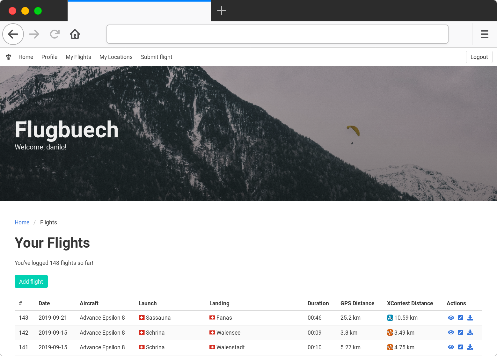

# Flugbuech

Personal flight log for paragliding pilots. Written with
[Rust](https://www.rust-lang.org/) / [Rocket](https://rocket.rs/) in
the backend and Bulma CSS / Svelte in the frontend.

This software is mostly aimed at pilots that track their flights using a GPS
tracker which generates IGC files, but it can also be used without an IGC file
for every flight.

A free hosted version of the flight book can be found at
[flugbuech.bargen.dev](https://flugbuech.bargen.dev/). If you want a
beta-account, just send me an e-mail to
[flugbuech@bargen.dev](mailto:flugbuech@bargen.dev). Alternatively you can also
host the software yourself.

The IGC file is stored together with the flight data. Every flight can be
linked to an [XContest](https://www.xcontest.org/) upload.

## Status

Right now this software is still under active development. There has been no
release so far.

### What works

- [x] User login / authentication
- [x] Adding flights to the database
- [x] Simple submission of of flights by uploading IGC file (all
  relevant flight data like launch time/location, landing time/location,
  duration, distance, etc can be extracted from that file)
- [x] Manage locations
- [x] Show stats about the past flights
- [x] Simple user registration

### What's not yet implemented

- [ ] Password recovery
- [ ] Map with all your flights
- [ ] Make it easy to self-host
- [ ] Import launch / landing locations from a public database
- [ ] Adding links to other XC platforms like [XCR](https://xc-paragliding.com/)

## Setup

Requirements:

- Rust nightly (see `rust-toolchain` file)
- PostgreSQL + PostGIS
- For building the frontend components: nodejs / npm
- For production environments: A reverse proxy like Nginx

Install `diesel_cli`:

    cargo install -f diesel_cli --no-default-features --features postgres

Set up PostgreSQL database:

    createdb flugbuech
    diesel setup

Run database migrations:

    diesel migration run

(Note: You can also apply migrations by starting with the `--migrate` flag)

Install frontend dependencies:

    npm install

Build frontend components:

    npm run build

Start server:

    cargo run

## Registration

In order to register a new user, head to localhost:8000/auth/registration.
Both email and username have to be unique and the password has to match password confirmation.
Upon successful registration you will be redirect to the root_path and will see
a welcome message bearing your username.

## Testing

First, set up a test database:

    createdb flugbuech_test

Run tests:

    cargo test

## Deployment

If you want to deploy this software using Docker, please take a look at the
provided `docker-compose.yml` file. It can serve as an example on how to host
Flugbuech. The image is also available [on Docker
Hub](https://hub.docker.com/r/dbrgn/flugbuech/), images are re-built at least
weekly.

Note that while the default server is able to serve static files, it's probably
a good idea to put an Nginx instance in front of the `/static` volume inside
the Docker container.

**IMPORTANT**: Make sure to change the `ROCKET_SECRET_KEY` variable when
configuring your deployment!

## License

Licensed under the AGPL version 3 or later. See `LICENSE.md` file.

    Copyright (C) 2019–2021 Danilo Bargen

    This program is free software: you can redistribute it and/or modify
    it under the terms of the GNU Affero General Public License as
    published by the Free Software Foundation, either version 3 of the
    License, or (at your option) any later version.

    This program is distributed in the hope that it will be useful,
    but WITHOUT ANY WARRANTY; without even the implied warranty of
    MERCHANTABILITY or FITNESS FOR A PARTICULAR PURPOSE.  See the
    GNU Affero General Public License for more details.

    You should have received a copy of the GNU Affero General Public License
    along with this program.  If not, see <https://www.gnu.org/licenses/>.

## Credits

- Background photo by [eberhard grossgasteiger on Unsplash](https://unsplash.com/photos/15KSFB1n0FU)
